#Task

You’ve signed up for the Padel Championship, but your rival keeps climbing the leaderboard. The admin panel controls match approvals and registrations. Can you crack the admin and rewrite the draw before the whistle?

Note: In case you want to start over or restart all services, visit `http://10.66.130.108/status.php`.

#Enumeration

We start with a normal nmap scan for all ports.

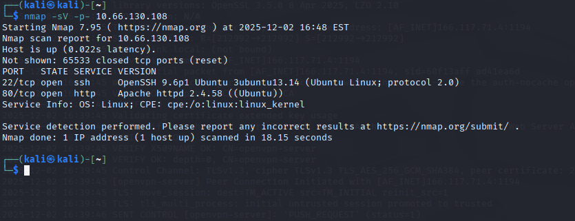

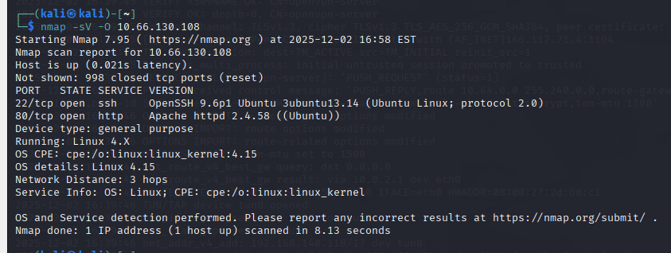

Nothing else there, we will do a more detailed enumeration later.

With dirsearch, we try to enumerate the target directories.

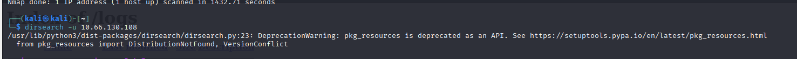

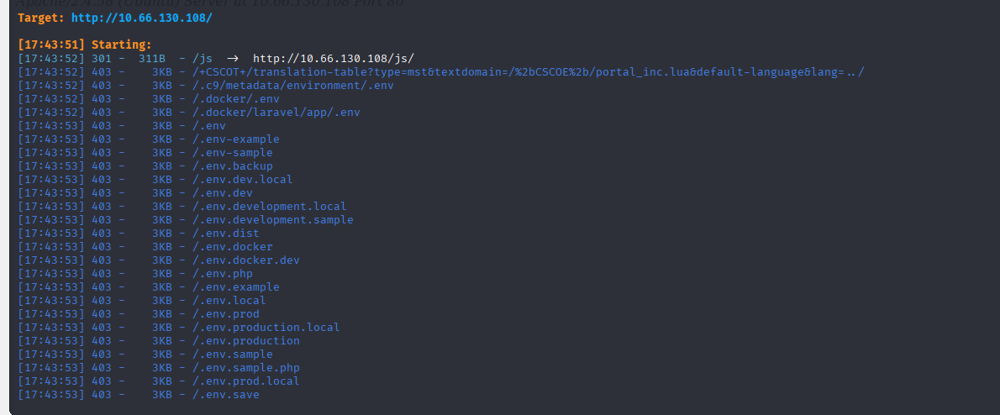

There are a lot here, I just screenshot part of them.

Let's first view the target website.

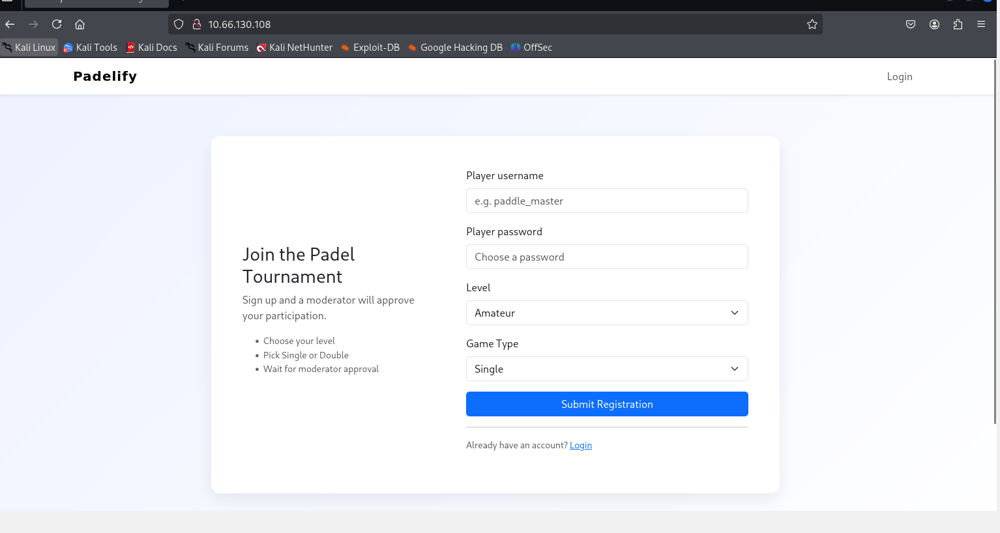

Let's register an account.

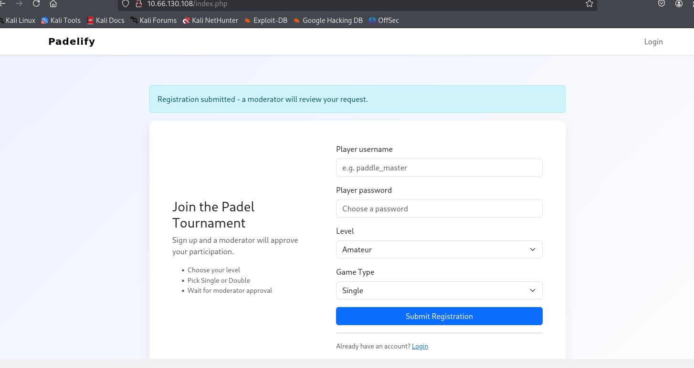

A moderator will view the request. 

Hmmm.... Is that mean may be we can inject the payload(eg. like a phishing website or something else?) in the register field?

Well, I tried a XSS command in the player field.

---

">

---

However, we trigger the WAF.

We need to find a way to bypass the WAF.

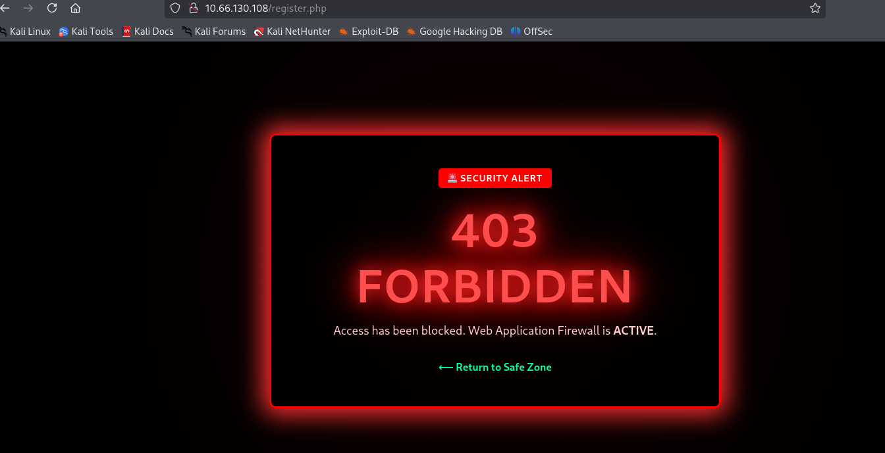

#Exploit

We start with detecting the WAF rules.

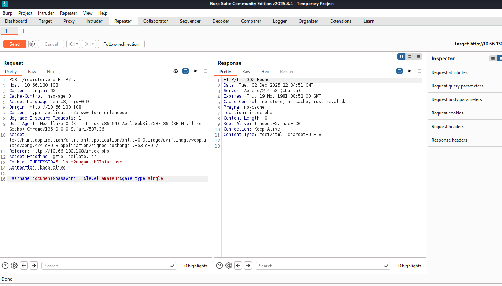

After some tries in Burp repeater, we find only 'document.cookie' will trigger WAF. However, simple 'document' or 'cookie' will not trigger WAF, which means maybe the WAF rule is making combination of the words and compare it. 

Let's avoid directly using docement.cookie, and using other words for a payload.

---

">

---

We start a simple server.

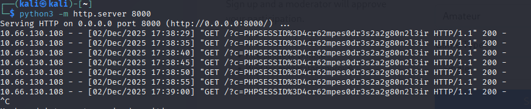

Received. Let's check it.

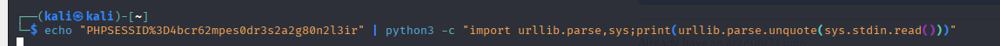

We decode it.

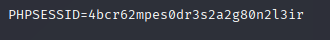

We have the id.

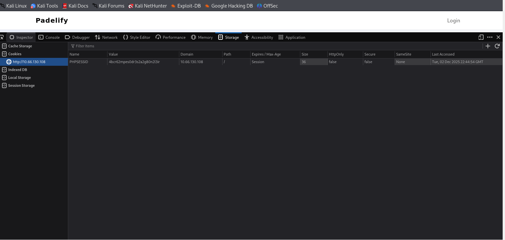

With the dev tools, we paste the id here. 

We try to use this cookie to visit dashboard.php, however, we still being redirect to login.php, which means this cookie may not have enough right.

So this is not the correct path, let's go back to the logs.

In dirsearch results, we noticed there are logs exist.

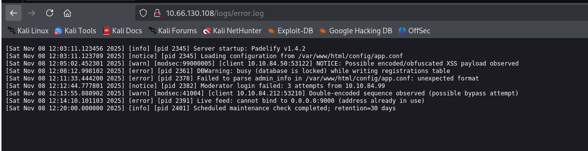

We have quite valuable info.

The path var/www/html.......

We can try this.

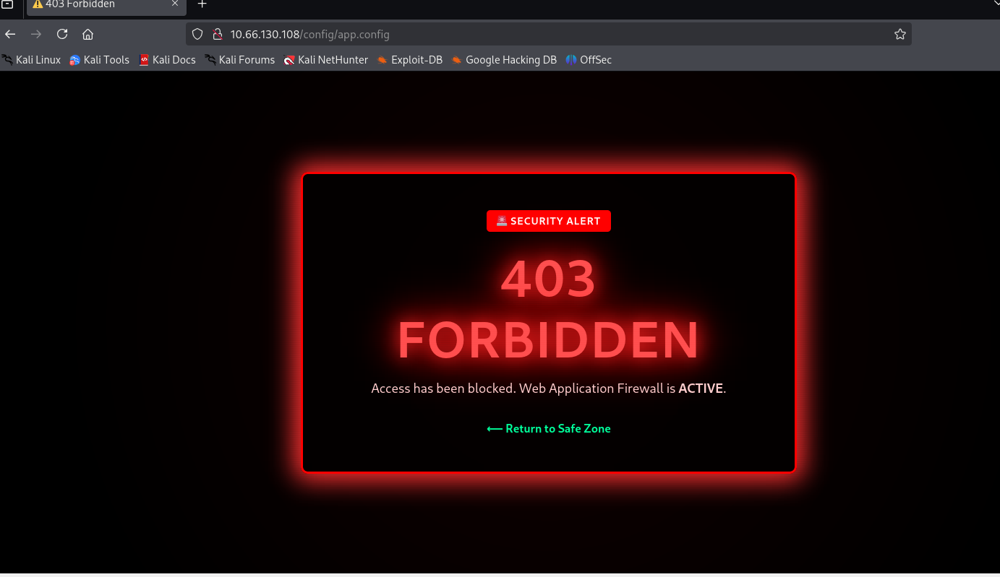

We are blocked. So we still need to find a way to bypass the WAF.

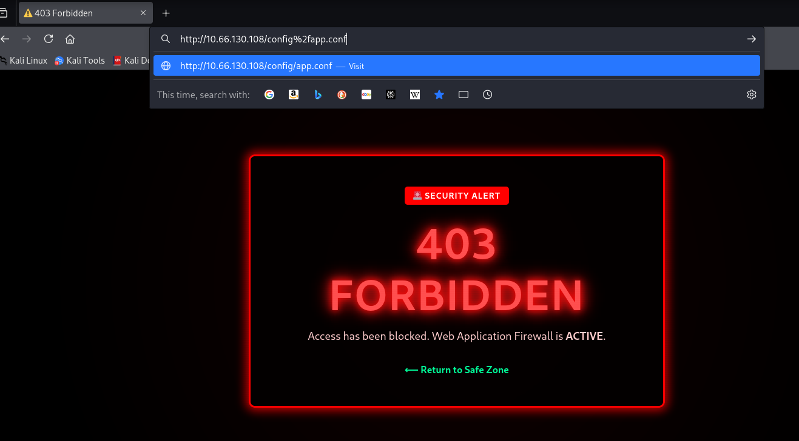

We tried the single encoded, and it is decoded by the WAF and blocked. Except one.

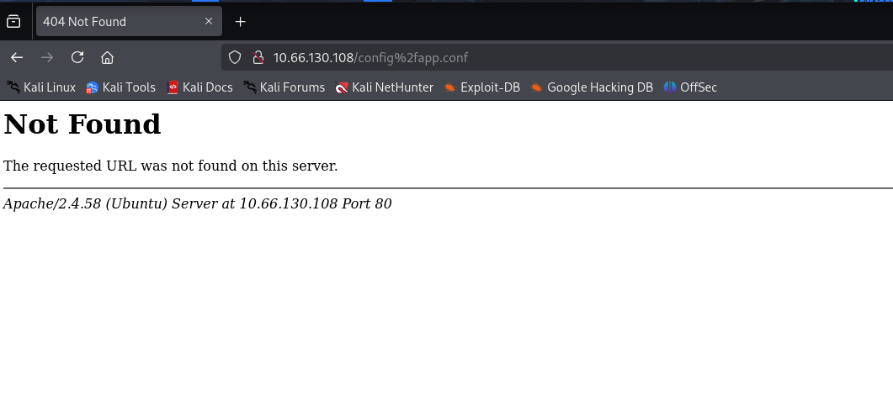

I remembered in error logs, it says double encoded may observed, which means double encoded may work.

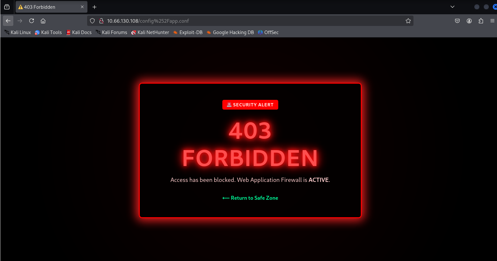

We are partly correct, WAF only docode for once. However, it is still blocked.

We tried the path traversal. And one is kind of work.

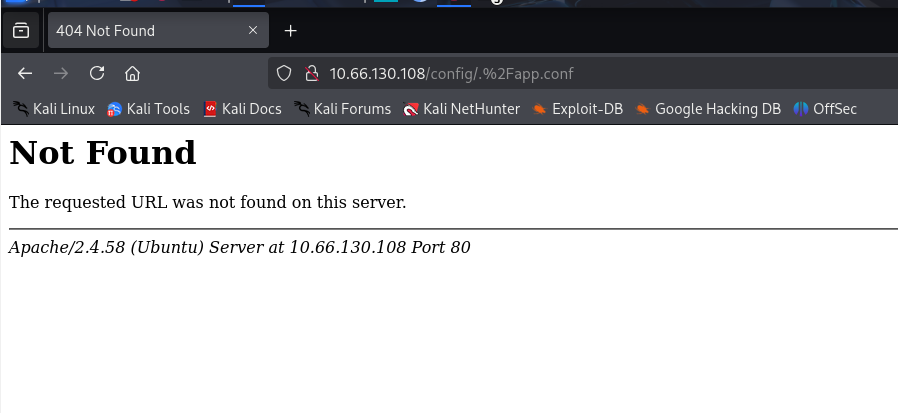

I come back and think for a minute. XSS is definitely  exist, maybe I made something mistakes here?

I go back and retry the XSS.

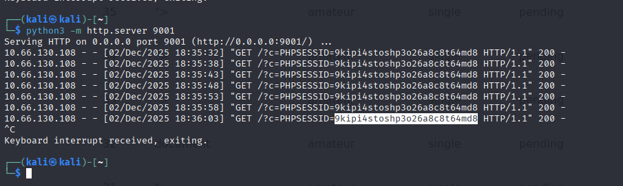

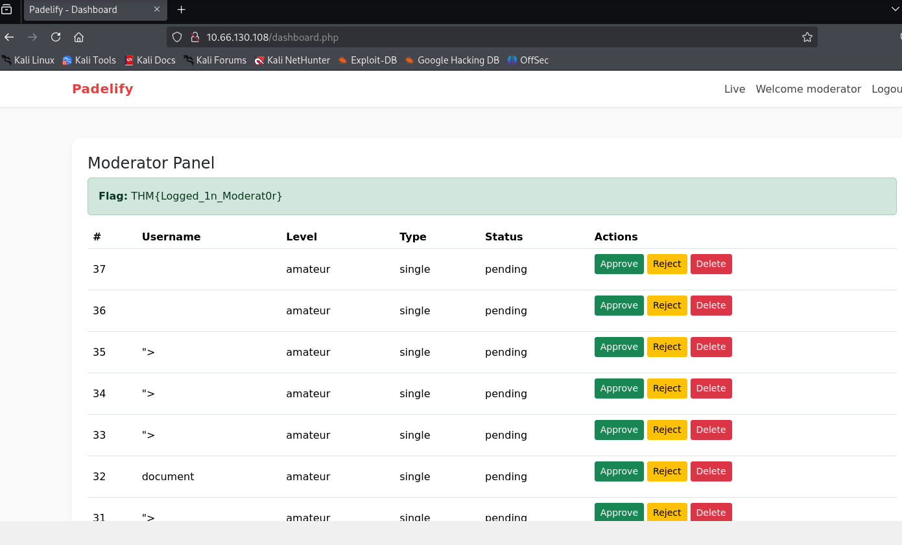

This time I success. I think I may made a silly mistake, I forgot to refresh it.

Nevermind, keep going.

#Escalation privilege

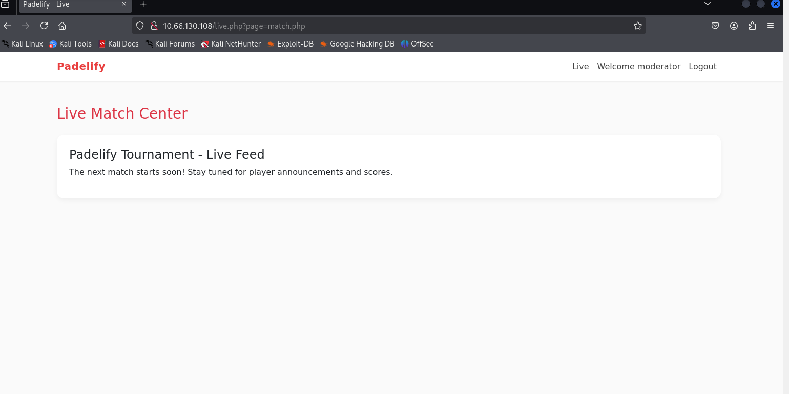

There is a live.php. I noticed in url there is a 'page=....'

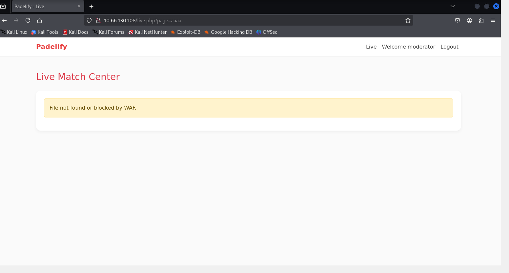

We make sure there is a LFI path, but it may be blocked by WAF for some files.

We remember the error logs file we read, let's try this.

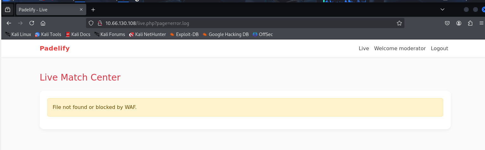

We are sure it is blocked.

Let's try to bypass this.

Remember the WAF only do one decode, so we try the double encoded.

However, we find once the url appear 'etc/passwd' or 'config/app.config', it will be blocked, which means WAF is based on string combination matching. Same with what we thought in XSS part.

Remember what we did in XSS part? We split the word and use string concatenation to bypass it.

Here, we success. Now we have the admin credential.

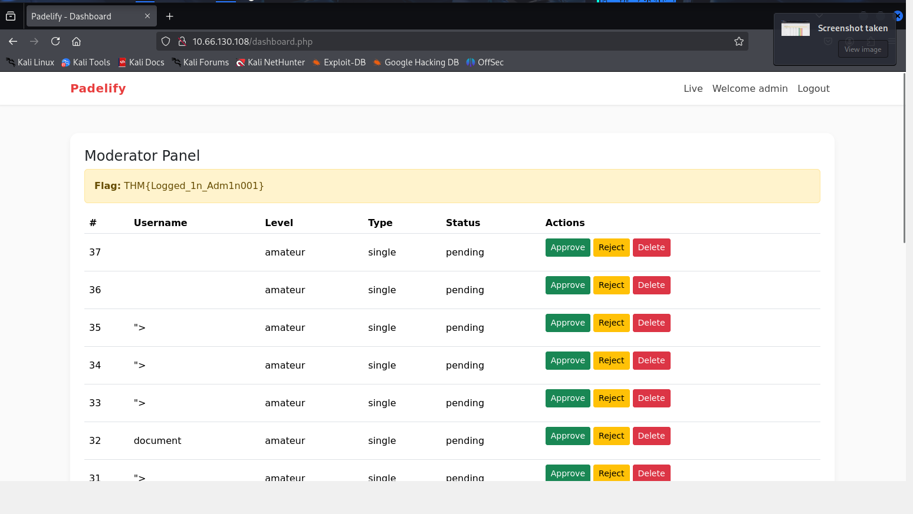

We are in.

Thanks for reading!